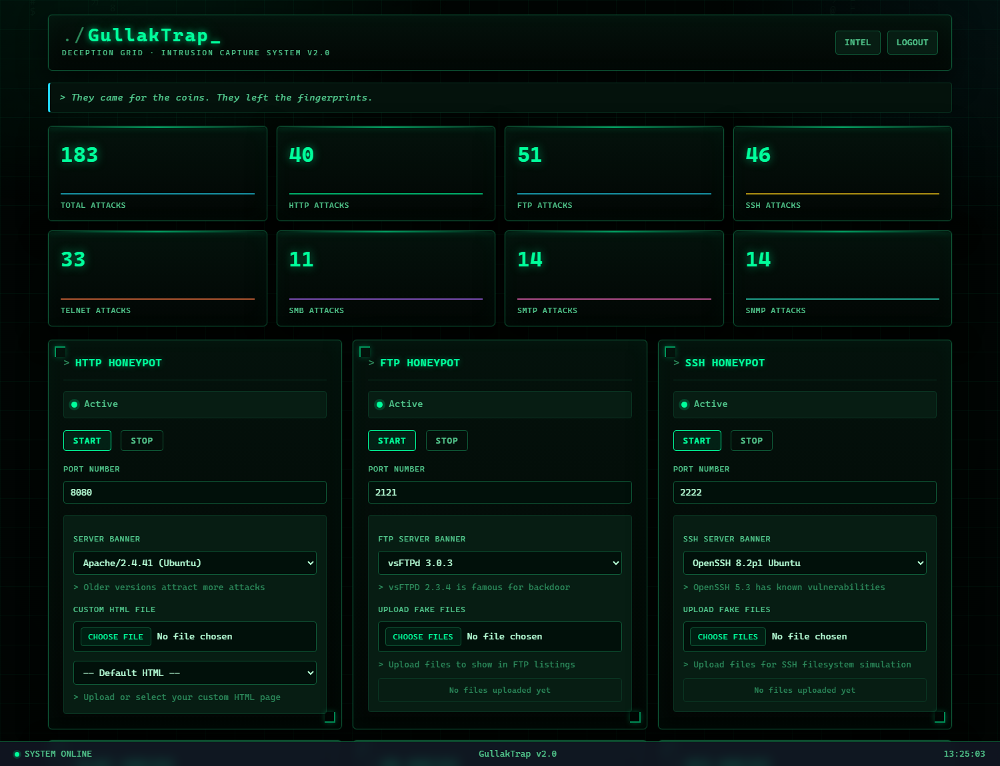
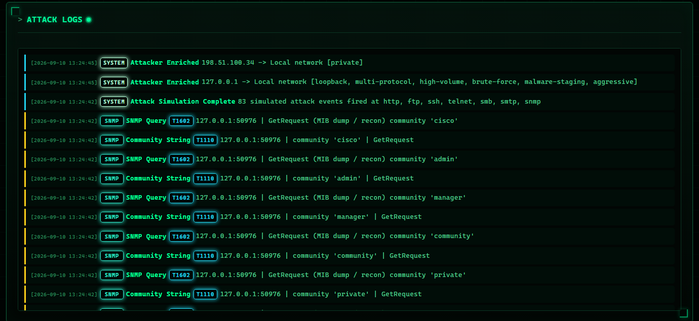
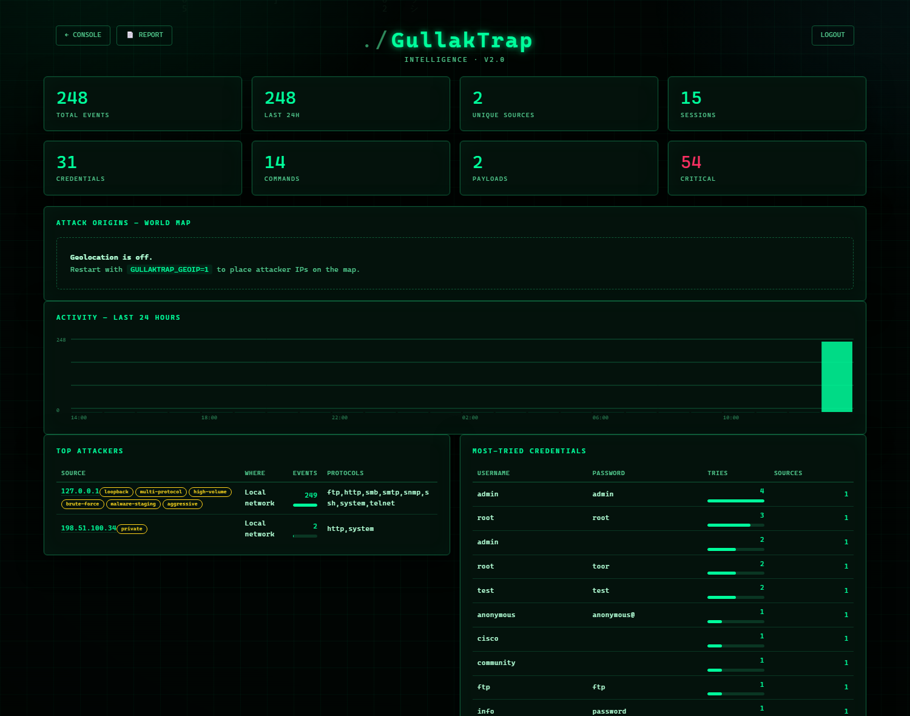
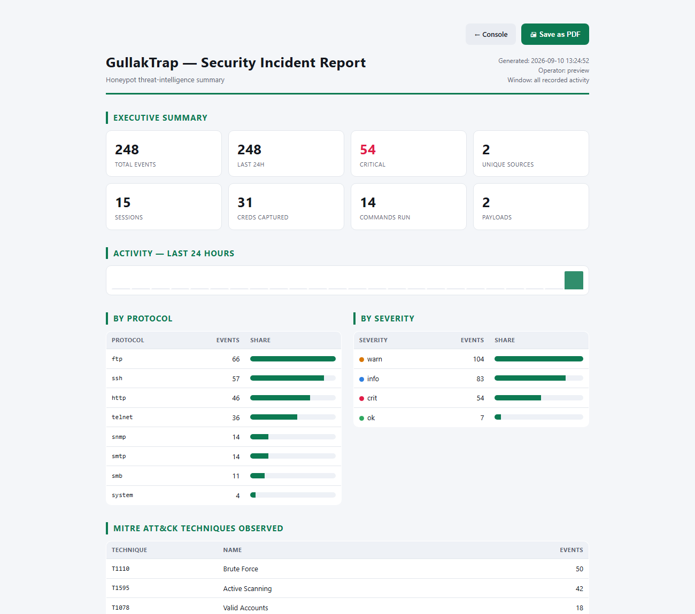

<div align="center">

# GullakTrap

### A seven-protocol honeypot that lets attackers in — and records everything they do.

Credentials tried, commands run, files touched, malware fetched. Every event
scored, mapped to **MITRE ATT&CK**, enriched with threat intel, and streamed to
a live console.

[](https://www.python.org/)
[](https://flask.palletsprojects.com/)
[]()
[]()
[]()
[](LICENSE)



</div>

---

## The idea

A honeypot is a machine whose only job is to be broken into. GullakTrap stands
up seven services that look old, unpatched and worth attacking — then logs every
keystroke of what happens next.

> **Why the name?** A *gullak* is a traditional Indian clay coin bank. It has no
> lid; it must be broken open to be emptied. Attackers come for what looks like
> an easy prize and leave their fingerprints on the way in.

**What makes it more than a logger:**

- **Seven protocols, one console** — HTTP, FTP, SSH, Telnet, SMB, SMTP and SNMP,
  each started and stopped at runtime with its own port and fake banner.
- **A real SSH shell** — attackers get a convincing filesystem to poke at, and
  every command plus its inter-keystroke timing is recorded and replayable.
- **Automatic triage** — each event gets a severity and a MITRE ATT&CK technique,
  so 200 raw log lines become "42 × T1110 Brute Force, 6 × T1105 Ingress Tool
  Transfer".
- **A built-in red team** — `attack_sim.py` speaks all seven protocols and stages
  realistic attacks, so the whole detection pipeline can be proven end to end
  without waiting for a real intruder.
- **Zero heavy dependencies** — 7,900 lines of Python on top of `flask` and
  `paramiko`. No database server, no message queue, no Docker required.

### Table of contents

[Screenshots](#screenshots) · [Sensors](#sensors) ·
[How it works](#how-it-works) · [Quick start](#quick-start) ·
[Attack simulator](#attack-simulator) · [Configuration](#configuration) ·
[Project layout](#project-layout) · [Security & scope](#security--scope)

---

## Screenshots

**Live attack feed** — every event tagged with its protocol, severity and ATT&CK
technique as it lands.



**Intelligence view** — KPIs, a geolocated attack map, a 24-hour activity
timeline, ranked attackers and the credentials they keep guessing.



**Printable report** — a one-click, print-optimised incident report; *Save as
PDF* needs no extra tooling.



---

## Sensors

Each sensor is an independent decoy, armed and disarmed from the console at
runtime.

| Protocol | Default port | Transport | What it captures |
|---|---|---|---|
| **HTTP** | `8080` | TCP | SQLi, XSS, path traversal, scanner user-agents, credential POSTs |
| **FTP** | `2121` | TCP | Credential brute force, directory listing, file upload/download |
| **SSH** | `2222` | TCP | Credential brute force, full interactive shell + keystroke timing |
| **Telnet** | `2323` | TCP | Credential brute force, IoT-style shell commands |
| **SMB** | `445` | TCP | Session setup, share enumeration, worm/ransomware probing |
| **SMTP** | `25` | TCP | `AUTH LOGIN` credential capture, `VRFY` enumeration, open-relay probing |
| **SNMP** | `161` | UDP | Community-string brute force, OID walks, device fingerprinting |

> **Privileged ports:** SMB (`445`), SMTP (`25`) and SNMP (`161`) are below 1024
> and need root/Administrator to bind. Without elevation, set a high port in the
> console — `1445`, `2525`, `1161`.

---

## How it works

```
   attacker traffic
          |
          v
+---------------------------------------------------+
|  SENSORS                                           |
|  http · ftp · ssh · telnet · smb · smtp · snmp     |
+---------------------------------------------------+
          |  raw events
          v
+---------------------------------------------------+
|  EVENT PIPELINE  (main.py)                         |
|                                                    |
|  classify.py  ->  severity + MITRE ATT&CK          |
|  intel.py     ->  geo / ASN / Tor / VPN tagging    |
|  capture.py   ->  payload URL capture              |
+---------------------------------------------------+
          |                              |
          v                              v
+--------------------+        +----------------------+
|  storage.py        |        |  alerting.py         |
|  SQLite ledger     |        |  webhook / Telegram  |
+--------------------+        +----------------------+
          |
          v
+---------------------------------------------------+
|  PRESENTATION                                      |
|  console · analytics_view.py · report_view.py      |
+---------------------------------------------------+
```

Every sensor hands its events to one sink, so classification, enrichment,
storage, alerting and the live feed all happen in one place — adding an eighth
protocol means writing one sensor, not touching the pipeline.

**Also included:** session replay at original keystroke timing · payload URL
capture with optional quarantined download · Slack/Discord/Telegram alerts on
critical events · CSV export of events, credentials, commands, sessions,
attackers and payloads · editable banners and served content per sensor.

---

## Quick start

**Requirements:** Python 3.10 or newer.

```bash
git clone https://github.com/jaylalkiya/gullaktrap.git
cd gullaktrap
pip install -r requirements.txt
python main.py
```

The console asks for an operator login, then comes up on
<http://localhost:5000>:

```
  ╔════════════════════════════════════════════════════════╗
  ║                                                        ║
  ║                  G U L L A K T R A P                   ║
  ║                  deception grid  v2.0                  ║
  ║                                                        ║
  ╚════════════════════════════════════════════════════════╝

  ▸ SECURE CONSOLE ACCESS
  ──────────────────────────────────────────────────────────
  ●  credentials read from HONEYPOT_USER / HONEYPOT_PASS

  ▸ DECEPTION GRID
  ──────────────────────────────────────────────────────────
  ●  OPERATOR  admin
  ●  CONSOLE   http://localhost:5000
  ●  NETWORK   http://192.168.1.24:5000
  ●  DATABASE  gullaktrap.db
  ○  GEOIP     off (set GULLAKTRAP_GEOIP=1)
  ○  ALERTING  off (set GULLAKTRAP_WEBHOOK)
  ○  PAYLOADS  URL only (set GULLAKTRAP_FETCH_PAYLOADS=1)

  ▸ SENSORS   idle until armed from the console
  ──────────────────────────────────────────────────────────
  ○  HTTP   8080    ○  FTP    2121    ○  SSH    2222
  ○  TELNET 2323    ○  SMB     445*   ○  SMTP     25*
  ○  SNMP    161*
     SNMP listens on UDP; every other sensor is TCP.
     * under 1024 -- needs Administrator, or pick a high port
  ──────────────────────────────────────────────────────────
  A gullak only opens once it is full. So does this one.

  ▸ console ready  ->  http://localhost:5000
    test the pipeline  ->  python attack_sim.py     stop  ->  Ctrl+C
```

To start unattended (scripts, containers, CI), supply the login up front:

```bash
# Linux / macOS
HONEYPOT_USER=admin HONEYPOT_PASS=secret python main.py

# Windows PowerShell
$env:HONEYPOT_USER="admin"; $env:HONEYPOT_PASS="secret"; python main.py
```

Then log in, arm the sensors you want, and prove the pipeline works:

```bash
python attack_sim.py
```

Or click **⚔ Launch Simulated Attack** in the console. Watch **Attack Logs**
fill up, then open **INTEL** for the map, charts, ATT&CK breakdown and PDF
report.

---

## Attack simulator

`attack_sim.py` speaks each sensor's native protocol and fires staged, realistic
attacks: credential brute force and post-login shell activity (`cat /etc/passwd`,
`wget` of malware, `rm -rf`) against SSH/FTP/Telnet; injection and traversal
payloads against HTTP; and protocol-specific abuse against SMB, SMTP and SNMP.

```bash
python attack_sim.py                       # every sensor, localhost, default ports
python attack_sim.py --only ssh,telnet     # target a subset
python attack_sim.py --skip ftp --delay 2  # skip a sensor, pause between sensors
python attack_sim.py --brute 10            # 10 credential attempts per sensor
python attack_sim.py --scenario recon,brute
python attack_sim.py --smb-port 1445       # match a non-default console port
```

| Flag | Purpose | Default |
|---|---|---|
| `--host` | Target host | `127.0.0.1` |
| `--only` / `--skip` | Comma-separated sensor include / exclude list | all |
| `--scenario` | `recon`, `brute`, `exploit`, `malware`, `shell`, `persist` | `all` |
| `--brute` | Credential attempts per brute-forceable sensor | `5` |
| `--delay` | Seconds to pause between sensors | `0` |
| `--<sensor>-port` | Override a sensor's port | per-sensor default |
| `--yes-i-own-this` | Required to target a non-local host | off |

### Built-in safety

- The target defaults to `127.0.0.1`. Any non-loopback, non-RFC1918 host is
  **refused** unless you explicitly pass `--yes-i-own-this`.
- Simulated malware URLs use the non-routable **RFC 5737** documentation range,
  so nothing real is ever fetched.

This tool is for exercising honeypots **you operate**. Nothing else.

---

## Configuration

All configuration is environment variables — no secrets in the repository.

| Variable | Purpose | Default |
|---|---|---|
| `HONEYPOT_USER` / `HONEYPOT_PASS` | Console login (skips the interactive prompt) | prompts |
| `GULLAKTRAP_GEOIP` | `1` enables IP geolocation and Tor/VPN lookups | off |
| `GULLAKTRAP_WEBHOOK` | Slack/Discord webhook URL for alerts | off |
| `GULLAKTRAP_TG_TOKEN` / `GULLAKTRAP_TG_CHAT` | Telegram bot token and chat ID | off |
| `GULLAKTRAP_ALERT_LEVEL` | Minimum severity to alert on (`crit` or `warn`) | `crit` |
| `GULLAKTRAP_FETCH_PAYLOADS` | `1` downloads captured malware URLs to `quarantine/` | off |

> **On `GULLAKTRAP_FETCH_PAYLOADS`:** this fetches attacker-controlled URLs from
> your host. It is off by default and should only be enabled inside an isolated
> analysis environment.

> **On the world map:** with `GULLAKTRAP_GEOIP=1`, real attacker IPs are plotted.
> Loopback and private-range sources — including your own simulator runs — are
> never mapped, so the map fills in only when genuine remote traffic reaches an
> exposed sensor.

---

## Project layout

| Path | Responsibility | Lines |
|---|---|---|
| `main.py` | Flask console, routes, event sink, dashboard template | 1,826 |
| `attack_sim.py` | Red-team attack simulator | 776 |
| `ssh_honeypot.py` | SSH sensor (Paramiko, interactive shell emulation) | 598 |
| `analytics_view.py` | Intelligence dashboard — charts, map, session replay | 593 |
| `ftp_honeypot.py` | FTP sensor | 561 |
| `storage.py` | SQLite persistence and analytics queries | 503 |
| `telnet_honeypot.py` | Telnet sensor | 423 |
| `branding.py` | Name, palette, theme and UI copy | 407 |
| `http_honeypot.py` | HTTP sensor | 370 |
| `smtp_honeypot.py` · `smb_honeypot.py` · `snmp_honeypot.py` | SMTP, SMB and SNMP (UDP) sensors | 856 |
| `intel.py` | GeoIP and threat-intel enrichment | 227 |
| `static/fx.js` | Console visual effects | 222 |
| `report_view.py` | Printable report template | 200 |
| `alerting.py` | Webhook and Telegram alerting | 171 |
| `netutil.py` | Port and network helpers | 139 |
| `capture.py` | Payload URL capture and optional quarantine download | 134 |
| `classify.py` | Severity scoring and MITRE ATT&CK mapping | 109 |

### Runtime artifacts

Generated at runtime and excluded from version control:

```
gullaktrap.db          SQLite event ledger
gullaktrap_logs.json   JSON event log
ssh_host_key.rsa       generated SSH host key
uploads/               files attackers upload
ftp_files/ ssh_files/ telnet_files/    files served to attackers
quarantine/            downloaded payloads (opt-in)
```

---

## Security & scope

GullakTrap is a **defensive** security research tool.

- Deploy sensors only on infrastructure you own or are explicitly authorised to
  operate.
- Use the attack simulator only against your own honeypot.
- A honeypot is intentionally attractive to attackers. Run it isolated from
  production networks and treat everything it captures as hostile input.
- Never enable payload downloading outside a sandboxed analysis environment.

Do not point any part of this project at systems you do not own or are not
authorised to test.

---

## Author

Built by **Jay Lalkiya** — [GitHub](https://github.com/jaylalkiya)

## License

Released under the [MIT License](LICENSE) — free to use, modify and
redistribute, with attribution and no warranty.
